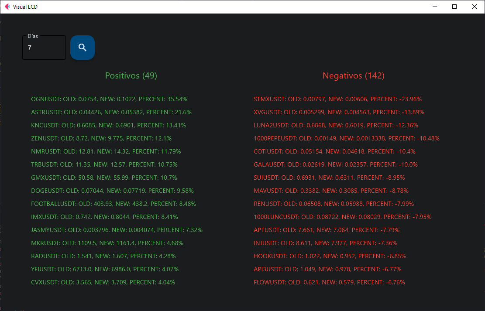

# Script LCD python para Binance

Este script fue desarrollado para poder analizar las monedas o tokens de futuros de Binance para poder operar con LCD en ellas.

**Como usar el script**
- Descargar python [Aqui](https://www.python.org/downloads/ "Aqui")
- Como no requiere de llaves de API se eliminaron
- Instale las librerias necesarias con el siguiente comando:
```python
pip install -r requirements.txt
```
- Una vez guardado el archivo debes ejecutarlo desde una terminal de tu sistema operativo que uses con el siguiente comando:
`python main.py`
- Para editarlo les recomiendo VSCode [Aqui](https://code.visualstudio.com/ "Aqui")
- La interfaz grafica usa el Framework Flet, para Linux requiere un paso adicional [Aqui](https://flet.dev/docs/guides/python/getting-started/ "Aqui")
- Si desea volverlo un ejecutable siga las instrucciones [Aqui](https://flet.dev/docs/guides/python/packaging-desktop-app/ "Aqui")


## Desde WSL

Correr los siguientes comandos para instalar python, activar el ambiente virtual e instalar los paquetes

```cmd
# Python installation
sudo apt update && upgrade
sudo apt install python3 python3-pip ipython3

# Optional ubuntu dependencies
sudo apt-get --reinstall install libgstreamer-plugins-base1.0-0
sudo apt install libmpv-dev libmpv2
sudo ln -s /usr/lib/x86_64-linux-gnu/libmpv.so.2 /usr/lib/x86_64-linux-gnu/libmpv.so.1
sudo ln -s /usr/lib/x86_64-linux-gnu/libmpv.so /usr/lib/libmpv.so.1

# Virtual environment configuration
sudo apt install python3-venv
python3 -m venv .venv/visualLCD

source .venv/visualLCD/bin/activate

# Requirements installation
pip install -r requirements.txt

# Command to run
python main.py
```